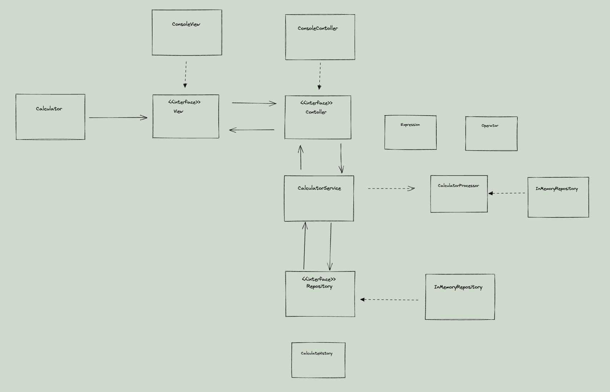

## 📌 과제 설명 

## 👩‍💻 요구 사항과 구현 내용
- 객체지향적인 코드로 계산기 구현하기
    - [v]  더하기
    - [v]  빼기
    - [v]  곱하기
    - [v]  나누기
    - [v]  우선순위(사칙연산)
- [v]  테스트 코드 구현하기
- [v]  계산 이력을 맵으로 데이터 저장기능 만들기




### 클래스 설명

* `Application` : 프로그램 실행에 필요한 각 구현체들을 만들어 Calculator 클래스에 주입하고 실행합니다.
* `Calculator` : View를 실행하면서 실행과전에 나온 예외들을 처리합니다.
* `View` : 콘솔을 통해 사용자와의 입출력을 담당하고 요청을 Controller에게 전달 합니다.
* `Controller` : View로부터 받은 요청을 서비스로 요청합니다.
  * `Expression` 객체 생성과정에서 계산식을 Valdiation 합니다.
* `CalculatorSerivce` : 컨트롤러에게 조회 반환 및 계산과정에서의 비즈니스 로직을 담당합니다.
  * 연산은 CalculatorProcessor에게 위임합니다.
* `Expression` : 문자열 # java_calculator
  자바 계산기 구현 미션 Repository입니다.

### 이곳은 공개 Repo입니다.
1. 여러분의 포트폴리오로 사용하셔도 됩니다.
2. 때문에 이 repo를 fork한 뒤
3. 여러분의 개인 Repo에 작업하며
4. 이 Repo에 PR을 보내어 멘토의 코드 리뷰와 피드백을 받으세요.
  
### Branch 명명 규칙 + 팀의 PR규칙 정하기
1. 여러분 repo는 알아서 해주시고 😀(본인 레포니 main으로 하셔두 되져)
2. prgrms-be-devcourse/spring-board 레포로 PR시 branch는 gituser_id을 적어주세요 :)
  - base repo : `여기repo` base : `username` ← head repo : `여러분repo` compare : `main`또는 `github_id`
3. 실제 진행할 PR규칙은 멘토+팀원들과 정하여 진행해주세요 :)
  - ← head repo : `여러분repo` compare : `main`로 할지
  - 또는 ← head repo : `여러분repo` compare : `github_id`로 할지
- 참고 : [Github 위치 및 피드백 기준 가이드](https://www.notion.so/backend-devcourse/Github-e1a0908a6bbf4aeaa5a62981499bb215)

### 과제를 통해 기대하는 역량

- 깃허브를 통한 코드리뷰를 경험해보자
- 기본적인 테스트 코드 작성 및 활용하는 능력해보자
- 스스로 OOP를 생각하고 코드로 옮길 수 있는 능력해보자

### 요구사항
- 콘솔로 구현입니다.(스윙으로 구현하시는 분들 계실까봐)
- 객체지향적인 코드로 계산기 구현하기
  - [ ]  더하기
  - [ ]  빼기
  - [ ]  곱하기
  - [ ]  나누기
  - [ ]  우선순위(사칙연산)
- [ ]  테스트 코드 구현하기
- [ ]  계산 이력을 맵으로 데이터 저장기능 만들기
  - 애플리케이션이 동작하는 동안 데이터베이스 외에 데이터를 저장할 수 있는 방법을 고안해보세요.
- (선택) 정규식 사용

### 실행결과(콘솔)
```
1. 조회
2. 계산

선택 : 2

1 + 2
3

1. 조회
2. 계산

선택 : 2

1 + 2 * 3
7

1. 조회
2. 계산

선택 : 1

1 + 2 = 3
1 + 2 * 3 = 7

선택 : 2

3 - 2 * 2
-1
```


올바른지 검증하고 전달하는 용도의 Value Object입니다.
* `Oprator` : 사칙연산을 담당하는 enum Class 입니다.
* `CalculatorProcessor` : Expression 객체에서 계산식을 받아 Operator 를 이용하여 계산한 결과를 반환해줍니다.
* `CalculateHistory` : 계산식 및 계산 결과를 저장하는 Entity Object입니다.
* `InMemoryRepository` : 메모리상에 상주하며 엔티티를 조회하고 저장을 담당합니다.
  * Map<Key, Object>로 엔티티 객체들을 저장합니다.
* `IdGenerator`: 엔티티 객체의 Id값을 generate하는 클래스 입니다.


## ✅ PR 포인트 & 궁금한 점 <!-- 리뷰어 분들이 집중적으로 보셨으면 하는 내용을 적어주세요 -->


리뷰 잘 부탁드리겠습니다 감사합니다! (__)
<br>


완성해놓고 보니 요구사항에 맞는 간단한 애플리케이션보다 더 잘 만들어볼라고 구현하다가

과해진거 같은 부분이 없지 않다는 생각을 했습니다.!

* 인텔리제이 다이어그램 기능을 보다보니 관계가 생각보다 복잡한거 같습니다..
* 클래스가 많아지다보니 관리포인트도 늘어남을 느꼈습니다.

---

* MVC 패턴을 생각하면서 구현했습니다. MVC 패턴에 맞지 않는 요소들이나 설계 및 구현 방법이 잘못된 부분들을 짚어주시길 부탁드립니다!

  

* 구현하면서 각 객체들의 역할과 책임에 맞게 나누려 했으나 제대로 나눠지지 않거나 너무 과하게 나눠진거 같습니다.

  *  책임에 맞지 않는 부분들을 말씀해주시길 부탁드립니다!
    

* 객체지향적으로 구현하려 했으나, 인터페이스들을 올바르게 사용하지 못한거 같습니다. 

  * 아쉬운 부분들이나 개선할 수 있는 부분들을 짚어주시면 감사하겠습니다!
    

* 각 클래스에서 나올 수 있는 다양한 상황들을 생각하면서 테스트코드를 작성했는데, 테스트 코드에 있어 보완할 점을 말씀해주시길 부탁드립니다!

  * 이런 테스트들은 과하거나 불필요한 부분도 있을까요?
    

* 예외처리에 관해서 좋은 방법이 있나 궁금합니다!.

  * Framework를 사용하면 Spring에서는 ControllerAdvice를 통해 공통적으로 예외를 처리하는데, Framework를 사용하지 않은 이런 간단한 애플리케이션에서 try-catch 등만을 이용해서 `공통 예외`나 `커스텀한 예외`들을 `깔끔하게` 처리할 수 있는 방법이 있을까요? 
  * 예외들을 상속받아 커스텀한다면, 기존 예외들을 사용하지 않건고 커스텀한 예외들을 만들거나 나누는 기준이 궁금합니다!

  

감사합니다!