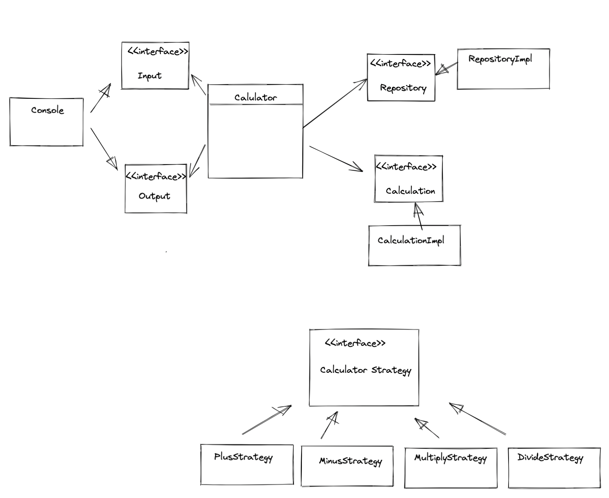

# java_calculator
자바 계산기 구현 미션 Repository입니다.

### 이곳은 공개 Repo입니다.
1. 여러분의 포트폴리오로 사용하셔도 됩니다.
2. 때문에 이 repo를 fork한 뒤
3. 여러분의 개인 Repo에 작업하며
4. 이 Repo에 PR을 보내어 멘토의 코드 리뷰와 피드백을 받으세요.

### Branch 명명 규칙 + 팀의 PR규칙 정하기
1. 여러분 repo는 알아서 해주시고 😀(본인 레포니 main으로 하셔두 되져)
2. prgrms-be-devcourse/spring-board 레포로 PR시 branch는 gituser_id을 적어주세요 :)
    - base repo : `여기repo` base : `username` ← head repo : `여러분repo` compare : `main`또는 `github_id`
3. 실제 진행할 PR규칙은 멘토+팀원들과 정하여 진행해주세요 :)
    - ← head repo : `여러분repo` compare : `main`로 할지
    - 또는 ← head repo : `여러분repo` compare : `github_id`로 할지
- 참고 : [Github 위치 및 피드백 기준 가이드](https://www.notion.so/backend-devcourse/Github-e1a0908a6bbf4aeaa5a62981499bb215)

### 과제를 통해 기대하는 역량

- 깃허브를 통한 코드리뷰를 경험해보자
- 기본적인 테스트 코드 작성 및 활용하는 능력해보자
- 스스로 OOP를 생각하고 코드로 옮길 수 있는 능력해보자

### 요구사항
- 콘솔로 구현입니다.(스윙으로 구현하시는 분들 계실까봐)
- 객체지향적인 코드로 계산기 구현하기
    - [x]  더하기
    - [x]  빼기
    - [x]  곱하기
    - [x]  나누기
    - [x]  우선순위(사칙연산)
- [x]  테스트 코드 구현하기
- [x]  계산 이력을 맵으로 데이터 저장기능 만들기
    - 애플리케이션이 동작하는 동안 데이터베이스 외에 데이터를 저장할 수 있는 방법을 고안해보세요.
- (선택) 정규식 사용

### 실행결과(콘솔)
```
1. 조회
2. 계산

선택 : 2

1 + 2
3

1. 조회
2. 계산

선택 : 2

1 + 2 * 3
7

1. 조회
2. 계산

선택 : 1

1 + 2 = 3
1 + 2 * 3 = 7

선택 : 2

3 - 2 * 2
-1
```

### 🧑‍💻 요구 사항과 구현 내용

---


##### Console
* 입력, 출력 기능을 담당합니다.
##### Calculator
* 명령어를 입력받아 각 명령어에 맞는 기능을 수행하도록 합니다.
* 입력값이 1인 경우
    * 지금까지 계산을 했던 이력들을 모두 보여 줍니다.
* 입력값이 2인 경우
    * 계산을 하고 싶은 식을 입력하면 결과를 알려줍니다.
* 입력값이 q인 경우
    * 프로그램을 종료합니다.
* 다른 입력값이 들어온 경우 다시 입력을 받도록 합니다.
##### Calculation
* 계산 기능을 담당합니다.
##### Validation
* 계산을 하던 도중 잘못된 입력이 들어온 경우인지 계산을 할 수 없는 상황인지 확인합니다.
##### Strategy
* 연산 방법을 전략 패턴을 이용해서 구현해 보았습니다.
##### Repository
* 계산 이력을 저장하는 기능을 담당합니다.

### 💡 PR 포인트 & 궁금한 점

---
##### 1. TDD 관련
저는 일단 기능을 구현을 하고 프로그램이 돌아가게 하고 나서  
테스트를 하는 방법으로 했는데 이렇게 하는 것이 맞는지 궁금합니다!  
제가 거의 테스트 코드를 작성하는 법을 정확히 몰라  
제가 짠 방식이 어느 정도는 맞는 것인지 아니라면 어떤식으로 했어야 했는지 궁금합니다!
##### 2. 전략 패턴
전략 패턴을 사용한다고 사용해 봤는데 제가 한 것이 전략패턴이 맞고  
이번 과제에서 전략패턴을 사용하는 것이 맞는 상황인지 궁금합니다!!
##### 3. 네이밍 관련
클래스의 이름이나 변수 이름에 대해 저 나름대로 고민하고 만들긴 했는데  
제가 생각해도 너무 별로인 것 같아서 🥲 어떤 식으로 네이밍을 하는 것이 좋을까요..?

##### 4. 인터페이스
일단 저는 인터페이스를 통해 선언을 해놓은 메소드들을 일반 클래스를 통해 구현을 하여 사용을 했는데  
계산이력을 저장하고 계산을 처리하는 클래스들은 딱히 인터페이스가 필요없어도 됐을 것 같습니다.  
이런 기능들에도 인터페이스를 써도 문제가 되는건 아닌지 인터페이스를 쓰지 않고 하는 것이 더 나은지 궁금합니다!

