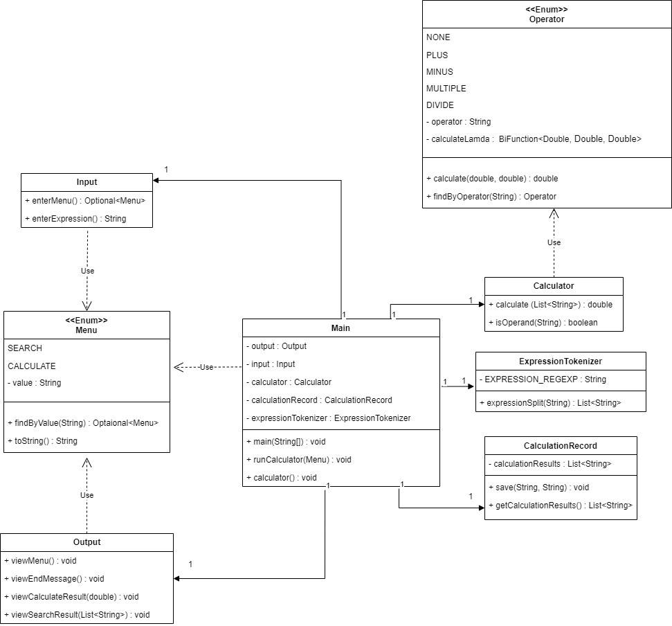

## 📌 과제 설명 
- 테스트 기반 & 객체지향적으로 계산기 프로젝트를 개발 하는 과제입니다. 

## 👩‍💻 요구 사항과 구현 내용 
- 객체지향적인 코드로 계산기 구현하기
    - [x]  더하기
    - [x]  빼기
    - [x]  곱하기
    - [x]  나누기
    - [x]  우선순위(사칙연산)
- [x]  테스트 코드 구현하기
- [x]  계산 이력을 맵으로 데이터 저장기능 만들기(인메모리 DB)
- (선택) 정규식 사용 (사용하지 않았습니다.)
---
### 🌳 프로젝트 tree 

### (1) io 패키지 
- **Input.java** : 사용자 입력 interface 
- **Output.java** : 콘솔에서의 출력 interface
### (2) model 패키지  
- **Formula.java** :  식의 구조를 배열로 저장
- **CacheFormulaResult** : 캐시메모리에 저장할 구조 (formul,result)
### (3) repository 패키지
- **CacheMemory.java** : 캐시레포지토리 인터페이스입니다.
   -  boolean isCacheExit(String formula) : Cache에 formula가 저장되어있는지 boolean return
    - long cache(String s) : 저장되어있는 캐시 값 return
- **MemoryRopository.java** : 레포지토리 인터페이스입니다. 
    - void save(String formula, Long result);
    - void findAll() : 계산이력 저장소(List) 값 반환 => 조회함수
   - int size() : 계산이력 저장소(List)의 사이즈 반환
- **FormulaRepository.java** : 인터페이스 구현체입니다.

### (4) service 패키지 
 - **ValidationService.java** : 사용자 입력식 유효성 검증 
   - **Validation()** 
  	   - 사용자 입력식을 split(" ") 이후 String[]으로 받아 사용합니다.
  	    - 식의 구조가 잘못된 경우 (숫자와 연산자의 유효성, 위치체크, 정확한 식의 형태가 아닐때)
  	   - '/ ' 연산자 이후 0이 왔을 경우 
 - **PostFixService** : 후위표기법 변환 기능
    - **makePostFixFormula()** 
  	- 후위 표기법에 맞게 StringBuilder에 저장을 해준 후 StringBuilder를 공백기준으로 split하여 반환합니다.

 - **CalcService** : 후위표기법식 계산 기능
    - **calculate()** 
    	- 연산자를 만날경우 숫자 2개를 Stack 꺼내주어 계산한 값을 Stack에 push합니다. 
    -  **calcArithmetic()** : 사칙연산 계산 후 Stack에 저장하고 Stack 리턴합니다. 
### (5) utils 패키지
- **Funtion.java** : 다른 클래스에서 중복으로 사용되는 함수를 public static 메소드로 정의하였습니다. 
    - **isStrDigit()** : 문자열이 숫자인지 체크하는 함수
    - **isOperator()** : 문자가 연산자인지 체크하는 함수 
### (6) Calculator.java
- **parse()** : 사용자의 카테고리 입력값이 유효한지 체크합니다.
- 카테고리선택값에 따른 output, input 함수 호출과 카테고리에 맞는 기능 함수들을 호출합니다. 
### (7) Console.java
- Input과 Output 인터페이스를 상속받아 사용자의 입력을 return 해주고, output 함수들을 구현하고 있습니다. 

## 🐢 앞으로 더 구현해야할 부분
- 나누기 계산을 했을때 정수값만 나오는 부분을 실수형으로 나오게 수정
- 실수형 계산
- ~~중복된 계산시 계산 이력에 한번만 조회되는 부분 수정~~ 🔨

