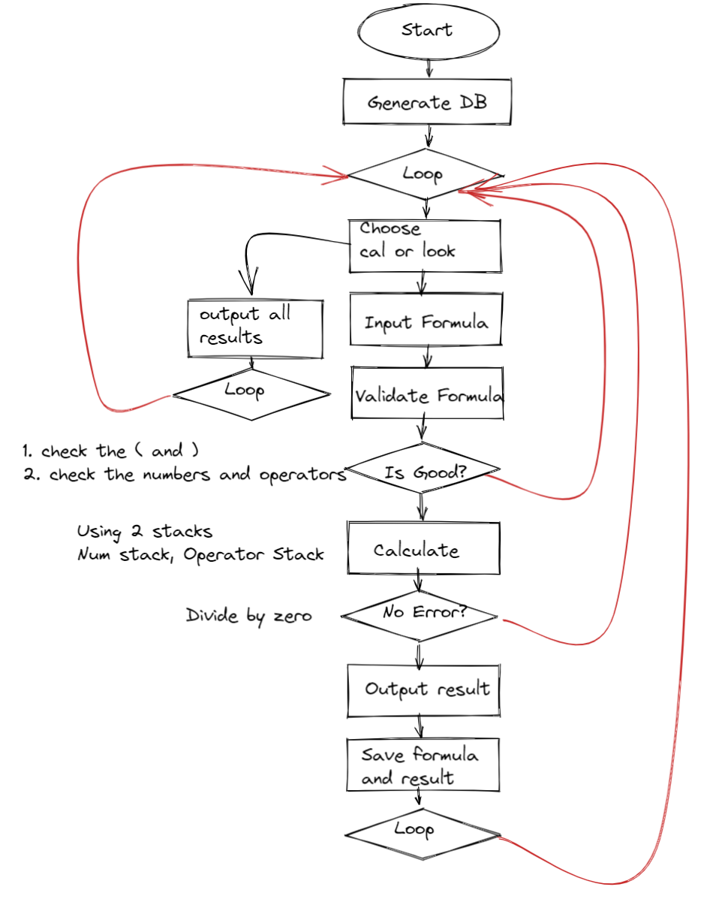
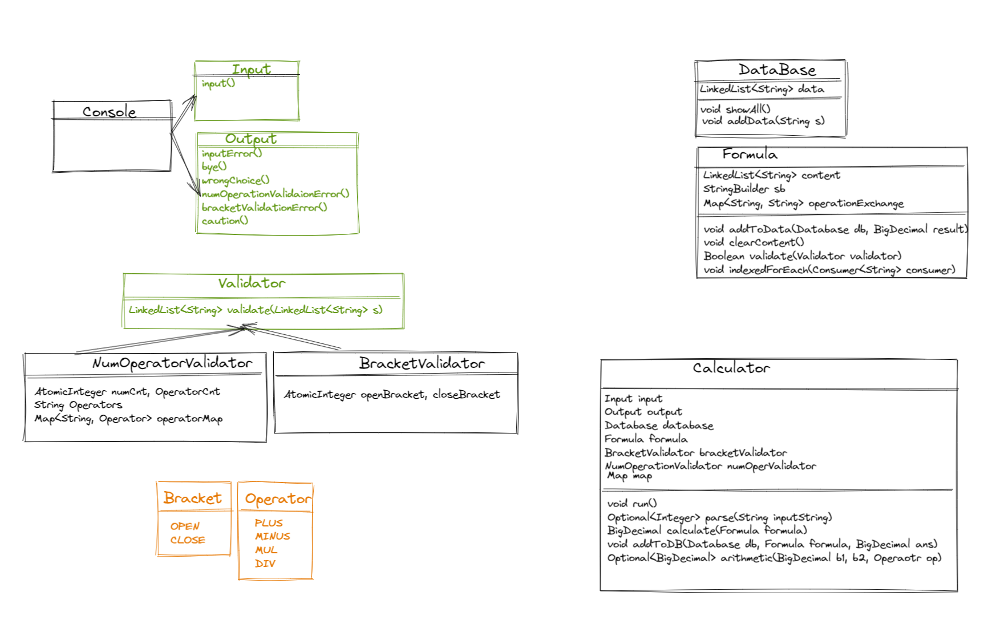

# OOP를 사용해서 계산기 구현하기
- 계산은 2 개의 Stack 으로 구현함
- 숫자와 연산자, 괄호는 공백을 기준으로 구분함
### 요구사항
- 객체지향적인 코드로 계산기 구현하기
    - [x]  더하기
    - [x]  빼기
    - [x]  곱하기
    - [x]  나누기
    - [x]  우선순위(사칙연산 + 괄호)
- [ ]  테스트 코드 구현하기
- [ ]  계산 이력을 맵으로 데이터 저장기능 만들기
    - 애플리케이션이 동작하는 동안 데이터베이스 외에 데이터를 저장할 수 있는 방법을 고안해보세요.
- (선택) 정규식 사용

## 워크 플로우

## 다이어그램
