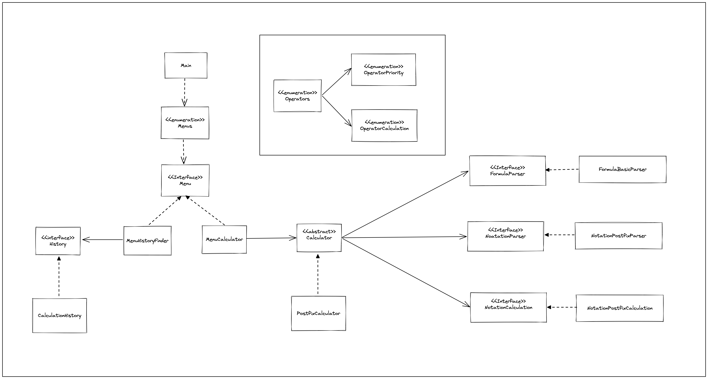

# java_calculator
자바 계산기 구현 미션 Repository입니다.

## 요구사항 정리

- [x] 메뉴 기능
  - 메뉴 출력 기능
    - [x] 조회 / 계산 메뉴 출력
    - [x] 메뉴 선택 번호 출력
    - [x] 최종값 출력
    - [x] 저장된 최종값 이력 출력
  - 메뉴 입력 기능
    - [x] 메뉴 선택 입력
  - [x] 메뉴 루프 기능
- [x] 계산기 기능
  - 계산기 연산식 입력
    - [x] 연산식 입력 기능
  - 계산기 연산식 파싱
    - [x] 기본 연산식 파싱 기능
    - [x] 후위 표기법 파싱 기능
  - 계산기 표기법 연산 기능
    - [x] 후위 표시법 연산 기능
  - 계산기 사칙연산 기능
    - [x] 우선순위 연산 기능 
    - [x] 더하기
    - [x] 빼기
    - [x] 나누기
    - [x] 곱하기
- [x] 계산 이력 저장소
  - [x] 계산 이력 저장 기능
  - [x] 계산 이력 조회 기능

## 테스트 정리

- OperatorCalculationTest
  - [x] 정수형 더하기 연산 성공 테스트
  - [x] 정수형 빼기 연산 성공 테스트
  - [x] 정수형 곱하기 연산 성공 테스트
  - [x] 정수형 나누기 연산 성공 테스트
  - [x] 소수형 더하기 연산 성공 테스트
  - [x] 소수형 빼기 연산 성공 테스트
  - [x] 소수형 곱하기 연산 성공 테스트
  - [x] 소수형 나누기 연산 성공 테스트
  - [x] 0 나누기 연산 실패 예외처리 테스트
- OperatorPriorityTest
  - [x] 연산자 연산 우선순위 비교 성공 테스트
  - [x] 연산자 연산 우선순위 비교 실패 테스트
- OperatorsTest
  - [x] 문자 연산자 외 문자 구별 성공 테스트
  - [x] 문자 연산자 구별 성공 테스트
  - [x] 문자 연산자 검색 후 연산 성공 테스트
  - [x] 문자 연산자 검색 후 우선 순위 비교 성공 테스트
  - [x] 문자 연산자 검색 후 우선 순위 잘못된 비교 결과 구별 성공 테스트
- FormulaBasicParserTest
  - [x] 정수 연산식 기본 파싱 성공 테스트
  - [x] 소수 연산식 기본 파싱 성공 테스트
  - [x] 정수, 소수 복합 연산식 기본 파싱 성공 테스트
  - [x] 잘못된 연산식 기본 파싱 실패 예외처리 테스트
  - [x] 연산식 내 잘못된 문자 파싱 실패 예외처리 테스트
- NotationPostfixParserTest
  - [x] 후위 표기법 파싱 성공 테스트
- NotationPostfixCalculationTest
  - [x] 후위 표기식 연산 성공 테스트
  - [x] 후위 표기법 연산 오류 예외처리 테스트
- PostfixCalculatorTest
  - [x] 정수형 연산식, 후위 표기식 연산 성공 테스트
  - [x] 실수형 연산식, 후위 표기식 연산 성공 테스트
- CalculationHistoryTest
  - [x] 연산 결과 저장 성공 테스트
  - [x] 연산 결과 조회 성공 테스트
  - [x] 연산 결과 저장 실패 예외처리 테스트

## 설계도



<br>
<br>

## 피드백


### 전반적인 피드백

- 코드의 복잡성을 따져라.
- 의미 없는 코드를 확인해라.
- 생성자 내에서 주입이 아닌 인자로 받아서 처리해라. -> 확장 용이
- 필요 없는 분리를 지양해라.
- 반환 타입이 와일드카드는 추천하지 않는다.
- 

### 테스트 피드백

- 중복되는 케이스 (데이터, 테스트)

<br>
<br>
<br>

### 이곳은 공개 Repo입니다.
1. 여러분의 포트폴리오로 사용하셔도 됩니다.
2. 때문에 이 repo를 fork한 뒤
3. 여러분의 개인 Repo에 작업하며 
4. 이 Repo에 PR을 보내어 멘토의 코드 리뷰와 피드백을 받으세요.

### Branch 명명 규칙 + 팀의 PR규칙 정하기
1. 여러분 repo는 알아서 해주시고 😀(본인 레포니 main으로 하셔두 되져)
2. prgrms-be-devcourse/spring-board 레포로 PR시 branch는 gituser_id을 적어주세요 :)  
    - base repo : `여기repo` base : `username` ← head repo : `여러분repo` compare : `main`또는 `github_id`
3. 실제 진행할 PR규칙은 멘토+팀원들과 정하여 진행해주세요 :) 
    - ← head repo : `여러분repo` compare : `main`로 할지
    - 또는 ← head repo : `여러분repo` compare : `github_id`로 할지
- 참고 : [Github 위치 및 피드백 기준 가이드](https://www.notion.so/backend-devcourse/Github-e1a0908a6bbf4aeaa5a62981499bb215)

### 과제를 통해 기대하는 역량

- 깃허브를 통한 코드리뷰를 경험해보자
- 기본적인 테스트 코드 작성 및 활용하는 능력해보자
- 스스로 OOP를 생각하고 코드로 옮길 수 있는 능력해보자

### 요구사항
- 콘솔로 구현입니다.(스윙으로 구현하시는 분들 계실까봐) 
- 객체지향적인 코드로 계산기 구현하기
    - [x]  더하기
    - [x]  빼기
    - [x]  곱하기
    - [x]  나누기
    - [x]  우선순위(사칙연산)
- [x]  테스트 코드 구현하기
- [x]  계산 이력을 맵으로 데이터 저장기능 만들기
    - 애플리케이션이 동작하는 동안 데이터베이스 외에 데이터를 저장할 수 있는 방법을 고안해보세요.
- (선택) 정규식 사용

### 실행결과(콘솔)
```
1. 조회
2. 계산

선택 : 2

1 + 2
3

1. 조회
2. 계산

선택 : 2

1 + 2 * 3
7

1. 조회
2. 계산

선택 : 1

1 + 2 = 3
1 + 2 * 3 = 7

선택 : 2

3 - 2 * 2
-1
```

