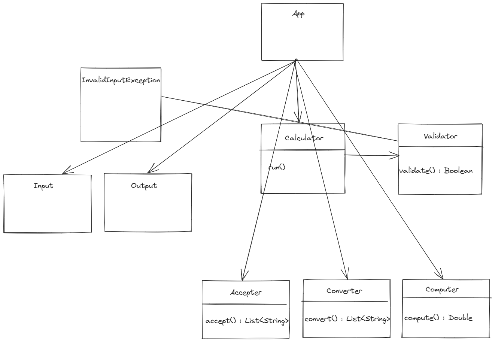

<!--
  템플릿은 아직 PR 작성이 익숙하지 않으신 분들을 위해서 제공하는 가이드입니다!
  리뷰어 또는 이 PR을 보게 될 다른 사람들이 이 PR을 보는데 참고할 수 있는 내용이 있다면 포함해서 작성해주시면 됩니다.
-->

## 📌 과제 설명 <!-- 어떤 걸 만들었는지 대략적으로 설명해주세요 -->
* `Calculator` : 모든 작업 요청, 결과가 이뤄지는 클래스
* `Validator` : 검증 인터페이스
* `Converter` : 후위변환 인터페이스
* `Computer` : 계산 인터페이스
* `Historian`   : 계산 기록, 출력 클래스
* `Input` : 입력 인터페이스
* `Output` : 출력 인터페이스
* `Operator` : 연산자 관련 enum 클래스
* `InvalidInputException` : 표현식 검증 Exception 클래스

## 👩‍💻 요구 사항과 구현 내용 <!-- 기능을 Commit 별로 잘개 쪼개고, Commit 별로 설명해주세요 -->
- #### 기능 구현
- [x] 검증
    - [x] 정규식
    - [x] 소수점 -> (?:) 패턴으로 부적절한 소수점 숫자 버림
- [x] 계산 -> BiFunction 을 갖는 enum 클래스(Operator)
    - [x] 더하기 -> Operator.PLUS
    - [x] 빼기 -> Operator.MINUS
    - [x] 곱하기 -> Operator.MULTIPLY
    - [x] 나누기 -> Operator.DIVIDE (0 나누기 예외처리)
- [x] 우선순위 (사칙연산)
    - [x] 괄호 -> Operator enum 클래스에 괄호 추가(우선순위 적용)
- [x] 이력 -> HashMap 활용
    - [x] 계산이력 저장
    - [x] 계산이력 조회 -> 조회할 기록이 없는 경우 예외처리

- #### 테스트
- [x] 계산 기능
    - [x] 검증
    - [x] 우선순위
    - [x] 계산결과
- [x] 이력 기능
    - [x] 이력 저장
    - [x] 이력 조회

## ✅ 피드백 반영사항  <!-- 지난 코드리뷰에서 고친 사항을 적어주세요. 재PR 시에만 사용해 주세요! (재PR 아닌 경우 삭제) -->

## ✅ PR 포인트 & 궁금한 점 <!-- 리뷰어 분들이 집중적으로 보셨으면 하는 내용을 적어주세요 -->
1. 커밋 기준
    * 초반 구조 변경 시 커밋 기준이 모호합니다.
2. 테스트 코드
    * 테스트 완료한 메소드 이용해 다른 테스트 코드의 테스트 데이터를 만들어도 되는지 궁금합니다.
        * 예) 검증이 완료된 표현식(validate)을 후위변환(convert) 메소드의 매개변수로 전달해서 테스트해도 되는지 궁금합니다.
        * 아니면, 현재 테스트하려는 기능에 대해서만 테스트 가능하도록 테스트 데이터를 만들어둬야 하는지 궁금합니다.
3. OOP
    * 의존성 생기는 걸 최대한 방지해보고자, App에서 Calculator로만 의존성을 주입하도록 했습니다.
        * 팩토리 패턴이라고 생각하는데 제대로 패턴 적용한 것인지 모르겠습니다.