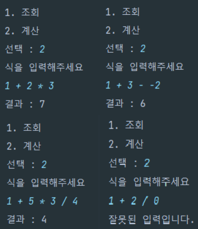

# 🔢 미션: [문자열 계산기](README_original.md)

### 실행결과(콘솔)
```
1. 조회
2. 계산

선택 : 2

1 + 2
3

1. 조회
2. 계산

선택 : 2

1 + 2 * 3
7

1. 조회
2. 계산

선택 : 1

1 + 2 = 3
1 + 2 * 3 = 7

선택 : 2

3 - 2 * 2
-1
```

## 요구사항 

- 객체지향적인 코드로 계산기 구현하기
    - [ ]  더하기
    - [ ]  빼기
    - [ ]  곱하기
    - [ ]  나누기
    - [ ]  우선순위(사칙연산)
- [ ]  테스트 코드 구현하기
- [ ]  계산 이력을 맵으로 데이터 저장기능 만들기
- [ ] 정규식 사용

## 🔧 구현 기능

### 출력
- [x] 선택 옵션(계산/조회/종료) 출력
- [ ] 사용자 선택 결과 출력
- [ ] 식 연산 결과 출력

### 입력
- [ ] 조회, 계산 옵션 입력
  - [ ] 사용자 입력 구분 (1 or 2)
- [ ] 사용자 식 입력

### 계산
- [ ] 연산 우선 순위 설정
- [ ] 입력된 식을 후위식으로 변경
- [ ] 후위식 계산 

### 조회 
- [ ] 연산 결과 저장
- [ ] 연산 결과 조회 

### 예외처리
- [ ] 정규식을 이용한 예외처리
- [ ] 피연산자의 개수가 연산자 개수보다 많거나 같은 경우 예외처리
- [ ] 빈 값 입력에 대한 예외처리

## UML & flow chart


## 피드백


